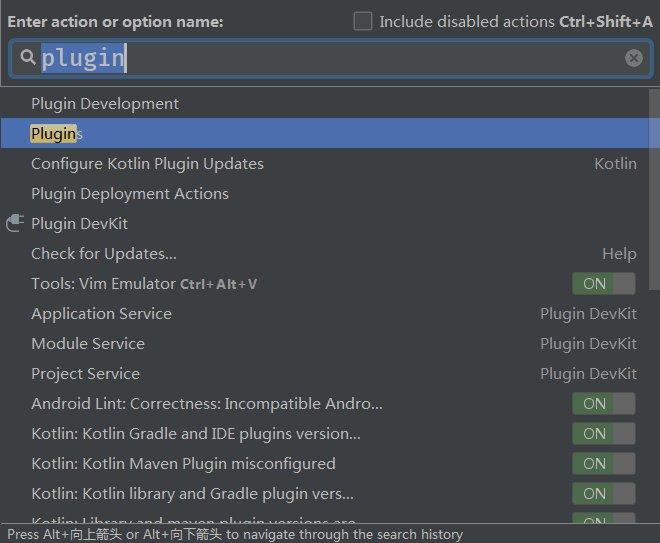
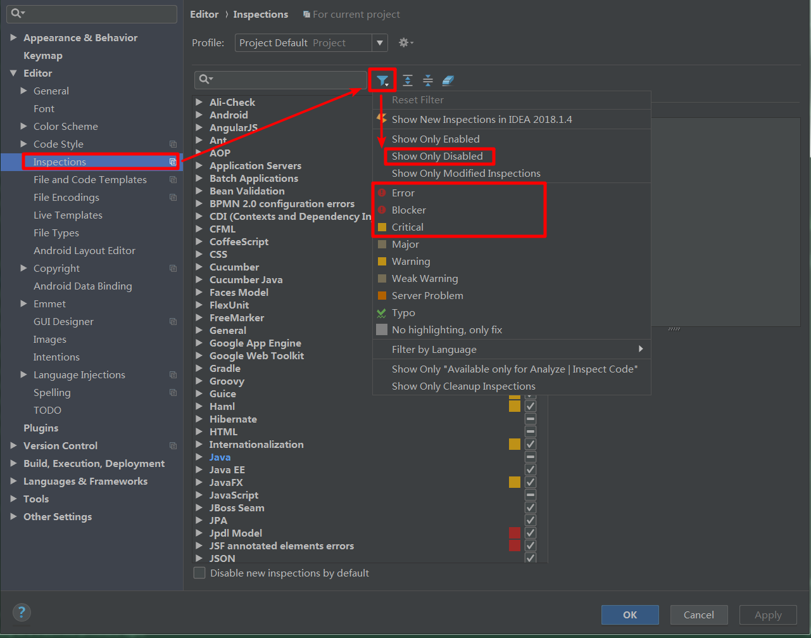

# IDEA 性能优化

使用 IDEA 能够提高工作效率。但是，不合适的配置可能会导致 CPU 使用率暴增，降低使用体验。以下是提升 IDEA 使用体验的「性能优化」建议。

# 分配更高 Java 虚拟机内存

如果虚拟机的内存过小，JVM 频繁 GC 也会使性能下降。下面是一个简单的虚拟机配置文件：

```
 -Xms2048m
 -Xmx2048m
 -Xmn512m
 -XX:PermSize=768m
 -XX:MaxPermSize=768m
 -Xss256K
 -XX:ReservedCodeCacheSize=240m
 -XX:SurvivorRatio=1
 -XX:+UseParNewGC
 -XX:+UseConcMarkSweepGC
 -XX:+UseCMSCompactAtFullCollection
 -XX:+UseCMSInitiatingOccupancyOnly
 -XX:CMSInitiatingOccupancyFraction=70
 -XX:+CMSParallelRemarkEnabled
 -XX:+CMSClassUnloadingEnabled
 -XX:CMSFullGCsBeforeCompaction=0
 -XX:LargePageSizeInBytes=200M
 -Dsun.io.useCanonCaches=false
 -Djava.net.preferIPv4Stack=true
 -XX:SoftRefLRUPolicyMSPerMB=0
 -XX:+DisableExplicitGC
 -XX:+PrintClassHistogram
 -XX:+PrintGCTimeStamps
 -XX:+PrintHeapAtGC
 -Xloggc:gc.log
 -Dide.no.platform.update=true
 ```

# 减少装载（load）的模块

在 [2017.2](https://blog.jetbrains.com/idea/2017/06/intellij-idea-2017-2-eap-introduces-unloaded-modules/) 中，IDEA 添加了减少装载（unload）模块的功能。在项目上 *右键* >> *Load/Unload Modules* 或者使用 *Ctrl+Shift+A* >> *Load* 搜索进入模块的配置界面，选择需要卸载的模块即可。


一般而言，当项目很大，而我们又只用到其中的几个模块，可以如此配置以提升性能。

# 减少不必要的插件

使用 *Ctrl+Shift+A* >> *Plugins* 调出插件管理界面，把一些不必要的第三方插件禁用掉。



# 使用合适的 JDK

IDEA 使用 Jetbrains 自带的 JDK 编译，理论上讲，使用他们自家的 JDK 能够提升编码体验。更换 IDEA 使用的 JDK 需要用到一个插件：`Get JB SDK from Bintary`。安装插件后，选择合适的 JDK 即可。


# 提高代码检查（Inspection）的级别

IDEA 会检查每次输入代码时，检查内容是否符合预设的检查级别。提高检查级别，会在一定程度上提升性能。在 *Settings* >> *Editor* >> *Inspections* 中筛选检查的级别为：`Error`、`Blocker`、`Critical`。



当然，忽略 `Warn` 级别的提醒在严格的生产环境中不提倡，这种做法却是平衡性能和安全之后的「最佳实践」。

# 取消自动构建（Auto Build）

自动构建会帮助我们检查潜在的代码错误，但如果每次我们保存代码时，IDEA 都帮我们构建会让系统变得很「卡」。取消自动构建，在需要的时候手动构建项目，不失为一种为解决卡顿的方法。在 *Settings* >> *Build, Execution, Deployment* >> *Compiler* 里取消勾选 `Build project automatically `。


# 清除缓存

选择 *File* >> *Invalidate Caches / Restart..* 可以在一定程度上提升 IDEA 的使用体验。


# 购买更好的硬件

奥义.终极解决方案！尽在不言中（穷人的微笑.jpg）